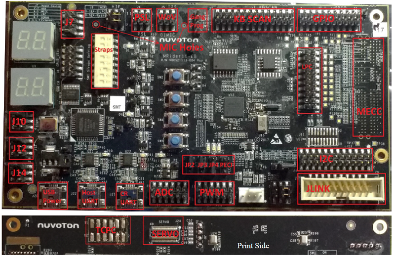

.. _npck3m7k_evb:

NPCK3M7K_POC
###################

Overview
********

The NPCK3M7K_POC kit is a development platform to evaluate the
Nuvoton NPCK3 series microcontrollers. This board needs to be mated with
part number NPCK3M7K.

Hardware
********

- ARM Cortex-M4F Processor
- 352 KB RAM and 64 KB boot ROM
- GPIO headers
- UART0 and UART1
- Jtag interface

Supported Features
==================

The following features are supported:

+-----------+------------+-------------------------------------+
| Interface | Controller | Driver/Component                    |
+===========+============+=====================================+
| NVIC      | on-chip    | nested vector interrupt controller  |
+-----------+------------+-------------------------------------+
| UART      | on-chip    | serial port-polling;                |
|           |            | serial port-interrupt               |
+-----------+------------+-------------------------------------+
| PINMUX    | on-chip    | pinmux                              |
+-----------+------------+-------------------------------------+
| GPIO      | on-chip    | gpio                                |
+-----------+------------+-------------------------------------+
| CLOCK     | on-chip    | reset and clock control             |
+-----------+------------+-------------------------------------+

Other hardware features are not currently supported by Zephyr (at the moment)

The default configuration can be found in the defconfig file:
``boards/arm/npck3m7k_poc/npck3m7k_evb_defconfig``

Connections and IOs
===================

Nuvoton to provide the schematic for this board.

System Clock
============

The NPCK3M7K MCU is configured to use the 90Mhz internal oscillator with the
on-chip PLL to generate a resulting EC clock rate of 15 MHz. See Processor clock
control register (chapter 4 in user manual)

Serial Port
===========

UART1 is configured for serial logs.

Programming and Debugging
*************************

This board comes with a Cortex ETM port which facilitates tracing and debugging
using a single physical connection.  In addition, it comes with sockets for
JTAG only sessions.

Flashing
========

Build application as usual for the ``npck3m7k_poc`` board, and flash
using Servo V2, μServo, or Servo V4 (CCD). See the
`Chromium EC Flashing Documentation`_ for more information.

Debugging
=========

Use JTAG/SWD with a J-Link

References
**********
.. target-notes::

.. _Putty website:
   http://www.putty.org
